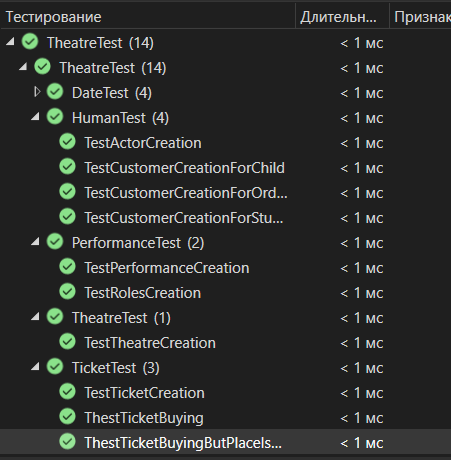
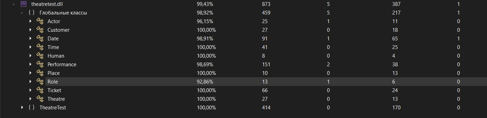

# **Система**
## Театр
# Классы:
- ```Time``` - время в 24 часовом формате ***hh:mm***
- ```Date``` - дата. Включает в себя класс `Time` и дату в формате ***dd.mm.yyyy***
- ```Human``` - базовый класс человека.
- ```Customer``` и ```Actor``` - классы наследники класса ```Human```
- ```Role``` - роль актера (```Actor```)
- ```Theatre``` - театр, характеристики театра
- ```Place``` - место в зале театра
- ```Performance``` - представление в театре
- ```Ticket``` - билет, который может быть создан объектом класса Customer с присвоением ему места или просто создан без занятого места 
---
- в программе есть проверки 
  - на корректность ввода даты и времени 
  - занятого места
 
# **Работа тестов**
## *Результат работы тестов:*



## *Покрытие:*




> Михалькевич Даниил;
> гр. 221701
